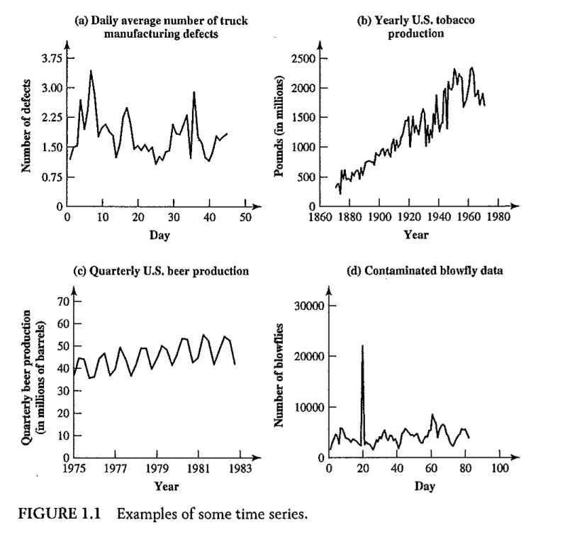
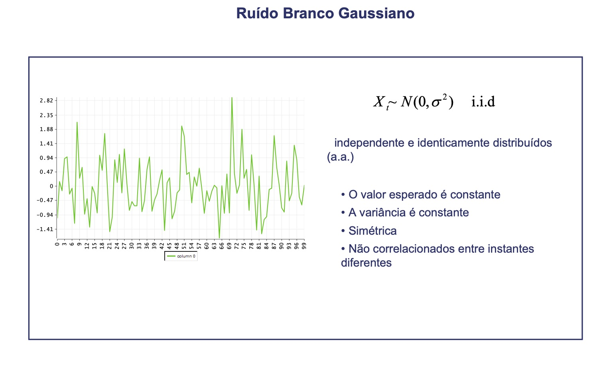
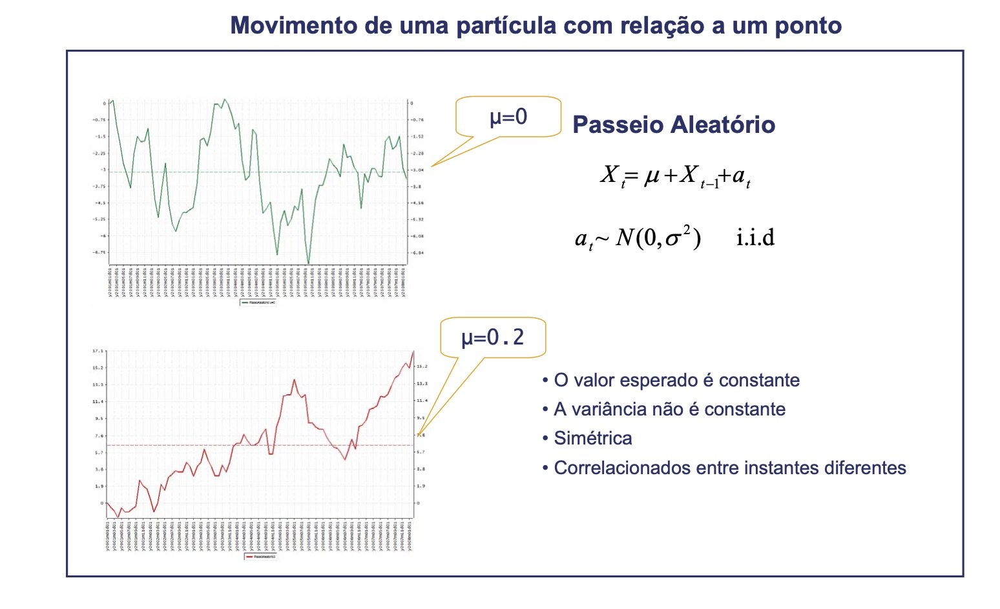
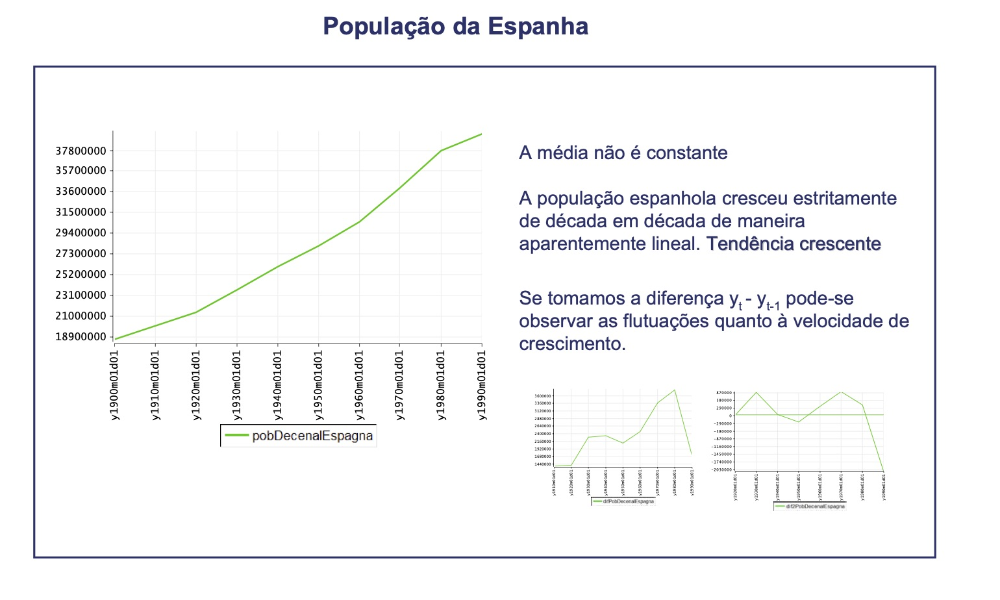
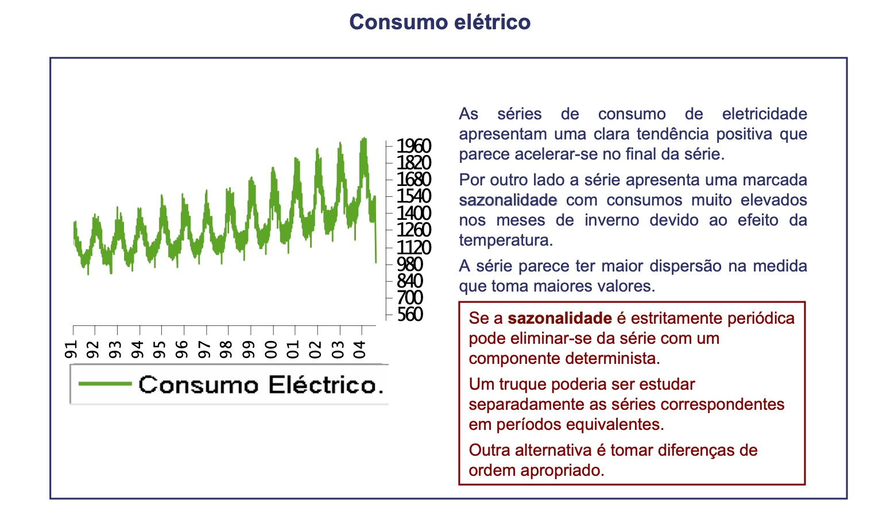
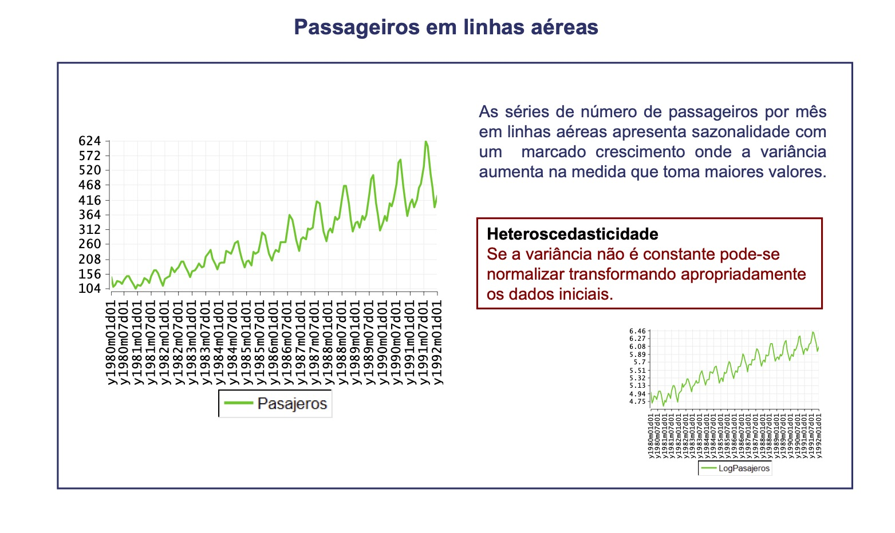
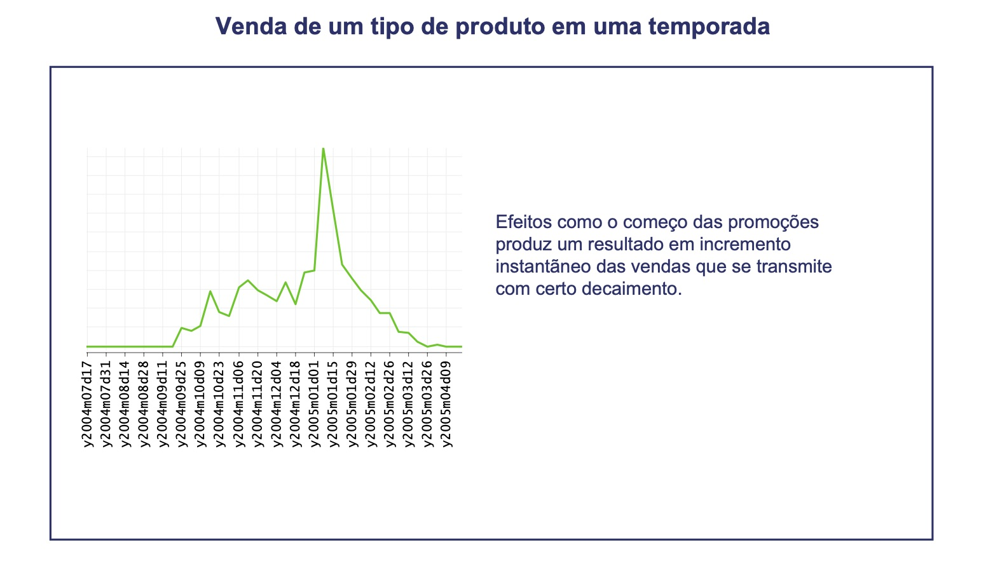

#Introdução

## O que é uma série temporal ?

Uma série temporal é um qualquer conjunto de observações ordenadas no tempo (Morettin & Toloi, 2004).

##Exemplos

1. Valores diários de poluição na cidade de São Paulo;
2. Valores mensais de temperatura na cidade de Cananéia;
3. Índices diários da Bolsa de Valores de São Paulo;
4. Precipitação atmosférica anual na cidade de Fortaleza;
5. Número médio anual de manchas solares;
6. Registro de marés no porto de Santos.

---
##Séries Temporais Discretas

Uma série temporal é discreta quando o conjunto de observações for tomado em tempos específicos, geralmente equiespaçados.

##Séries Temporais Contínuas
Uma série temporal é contínua  quando as observações são feitas continuamente no tempo.

##Algumas observações (Ehlers, 2008)

- Séries contínuas podem ser discretizadas se os valores são registrados a certos intervalos de tempo.
- Séries podem ser valores agregados ou acumulados em intervalos de tempo, exemplo, exportações medidas mensalmente ou quantidade de chuva medida diariamente.

---
#Exemplo

- Os exemplos 1 à 5 são séries temporais discretas, enquanto que o exemplo 6 é uma série temporal contínua.

- Observa-se que para analisar o exemplo 6, será necessário amostrá-la em um intervalo de tempo regular, convertendo a em uma série discreta.

- Em outros casos, como para as séries 4 ou 5, temos que o valor da série num dado instante é obtido acumulando-se (ou agregando-se) valores em intervalos de tempos iguais.

---
class: inverse, center, middle
#Gráficos de séries temporais

---
#Gráfico de série temporal

- Uma importante ferramenta em análise de séries temporais é o gráfico de séries temporais.

- Um gráfico de série temporal é um gráfico de dispersão com valores observados no eixo y e as datas correspondentes no eixo x.

---
#Exemplos de Gráficos de série temporal

a. Número médio diário de defeitos de fabricação de caminhões;

b. Produção anual de tabaco nos EUA;

c. Produção trimestral de cerveja nos EUA;

d. Número de moscas.
 

---
#Exemplos de Gráficos de série temporal

---
##Número médio diário de defeitos de fabricação de caminhões

- A série Número médio diário de defeitos de fabricação de caminhões aparentemente 
varia em torno de um nível fixo (uma média).

- Séries que apresentam esse comportamento são ditas serem estacionárias na média.

##Produção anual de tabaco nos EUA

- Por outro lado, a série produção anual de tabaco nos EUA aparenta exibir uma tendência;

- Além disso, a variância cresce ao longo do tempo;

- Série não estacionária.

---
##Produção trimestral de cerveja nos EUA

- A série produção trimestral de cerveja nos EUA apresenta outra característica padrão que é repetitiva 
devido a variação sazonal.

- São chamadas de séries temporais sazonais.

##Número de moscas

- Nessa série a não estacionariade é devida uma mudança na estrutura da série devida a uma perturbação externa (Intervenção).
- Para esses casos, transformações nos dados não resolverá o problema.

---
class: inverse, center, middle
#Alguns conceitos iniciais

---
## Tendência 

-  Uma mudança a longo prazo no nível da série. Crescimento ou descrescimento.

## Sazonalidade 

- Comportamento da série temporal tende a se repetir a cada $s$ períodos de tempo.

### Diferença entre padrões sazonais e cíclicos (Rob J. Hyndman)

-  Padrões sazonais tem comprimento constante enquanto que padrões cíclicos tem comprimentos variáveis;

-  O comprimento médio dos ciclos são mais longos do que padrões sazonais;

- Magnitude do ciclo é mais variável do que a do sazonal

[Rob](https://robjhyndman.com/)

---
class: inverse, center, middle
#Outros exemplos - Victor Hugo D'Avila

---

---

---

---

---

---
